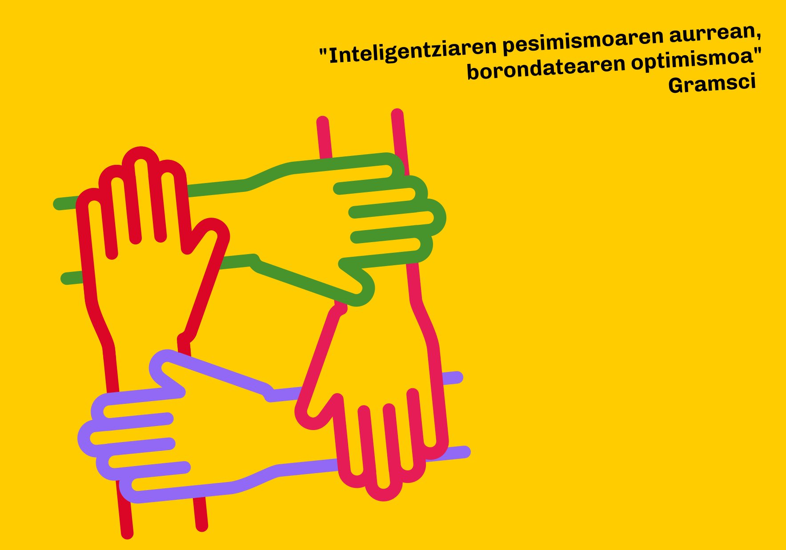

# ¡Intentadlo otra vez! Recogida de firmas por una lista unitaria entre Podemos Euskadi, Sumar Mugimendua, Ezker Anitza-IU y Equo-Berdeak / Saia zaitezte berriro! Podemos Euskadi, Sumar Mugimendua, Ezker Anitza-IU eta Equo-Berdeak alderdien arteko zerrenda bateratuaren aldeko sinadura bilketa

Como ciudadanos y ciudadanas vascas que compartimos valores y programas igualitaristas, ecologistas, feministas, pacifistas, federalistas, internacionalistas... asistimos con preocupación a la anunciada fractura del espacio político común que estas organizaciones han venido compartiendo durante años. Con la ruptura de esa alianza se debilitan las posibilidades de impulsar nuestras propuestas sociales y económicas para Euskadi.
Pero aún estamos a tiempo. Todas estas organizaciones dicen mantener la puerta abierta a concurrir conjuntamente a las próximas elecciones vascas. Y los comicios no se han convocado, y una vez se haga, quedarán todavía varios días para formalizar coaliciones.
Por eso apelamos a las organizaciones para que lo vuelvan a intentar, para que se reunan otra vez, y para que acompañadas de algunas personas facilitadoras, superen con generosidad y realismo sus diferencias y consigan así una unidad electoral respetuosa con su pluralidad,
Por eso firmamos y difundimos esta reclamación

Balio eta programa berdinzaleak, ekologistak, feministak, bakezaleak, federalistak, internazionalistak... partekatzen ditugun euskal herritarrak garen einean, kezkaturik gaude erakunde horiek urteetan partekatu duten esparru politiko komunaren haustura aurreikuspenaren aurrean. Aliantza hori hautsita, ahuldu egiten dira Euskadirako gure proposamen sozial eta ekonomikoak bultzatzeko aukerak.
Baina oraindik garaiz gabiltza. Erakunde horiek guztiek diote atea zabalik dutela euskal hauteskundeetan elkarrekin parte hartzeko. Eta hauteskundeak ez dira deitu, eta behin eginda, oraindik egun batzuk geratuko dira koalizioak egiteko.
Horregatik, erakundeei dei egiten diegu berriro saia daitezen, berriro bil daitezen, eta bideratzaile batzuek lagunduta, eskuzabaltasunez eta errealismoz gaindi ditzaten beren desberdintasunak, eta, horrela, beren aniztasuna errespetatuko duen hauteskunde batasuna lor dezaten.
Horregatik sinatzen eta zabaltzen dugu aldarrikapen hau.

<a href="https://forms.gle/q3ou5UES1ywUtMqH9" style="background-color:#fc0;padding:10px;border-radius:4px;color:black;text-decoration:none;cursor:pointer;">Firma por la lista unitaria / Sinatu zerrenda bateratuaren alde</a>

## Listado de firmantes / Sinatzaileen zerrend 
* Nombre Apellidos (organización)
* Nombre Apellidos (organización)
